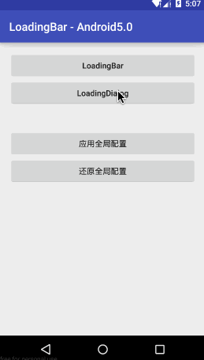

# LoadingBar

[English Document](https://github.com/dengyuhan/LoadingBar/blob/master/README-EN.md)
### 示例apk


## 快速开始
### Android Studio - 在build.gradle中引入
```java
compile 'com.dyhdyh.loadingbar:loadingbar:1.4.6'
```
#### LoadingBar
```java
//默认样式 loading将会覆盖在parent的内容上面
LoadingBar.make(parent).show();

//自定义样式
//提供两种形式,loadingView更简便,loadingFactory自由度更高
LoadingBar.make(parent,loadingView).show();
LoadingBar.make(parent,loadingFactory).show();

//完全自定义
LoadingBar.make(parent,loadingFactory)
        .setOnClickListener(clickListener)//点击事件
        .setOnLoadingBarListener(loadingBarListener)//当loadingbar取消的时候回调
        .show();
        
//取消Loading
LoadingBar.cancel(parent);
```

#### LoadingDialog
```java
//默认样式
LoadingDialog.make(context).show();

//自定义样式
LoadingDialog.make(context, dialogFactory).show();

//完全自定义
LoadingDialog.make(context, dialogFactory)
           .setMessage(message)//提示消息
           .setCancelable(cancelable)
           .show();

//设置更多属性
Dialog dialog = LoadingDialog.make(context, dialogFactory)
           .setMessage(message)//提示消息
           .setCancelable(cancelable)
           .create();
dialog.setOnCancelListener(cancelListener);
dialog.set...
dialog.show();
           
//取消Loading
LoadingDialog.cancel();
```


#### 自定义Factory
```java
public class CustomLoadingFactory implements LoadingFactory {

    @Override
    public View onCreateView(ViewGroup parent) {
        View loadingView = LayoutInflater.from(parent.getContext()).inflate(R.layout.layout_custom, parent,false);
        return loadingView;
    }
}
```


#### 全局配置
```java
//自定义样式并应用于全局
LoadingConfig.setFactory(loadingFactory,dialogFactory);

```


#### 资源释放
其实LoadingBar在cancel的时候已经释放掉了，可以不用手动释放，但是这里也提供释放的方法，根据自己需要选择

在Activity onDestroy调用，个人建议在BaseActivity，资源释放只会释放无效的资源
```java
LoadingBar.release();
```


更多玩法等你发掘，有问题或者建议可以在issues提出

###### Android交流群：[146262062](https://jq.qq.com/?_wv=1027&k=47XqOHO)
